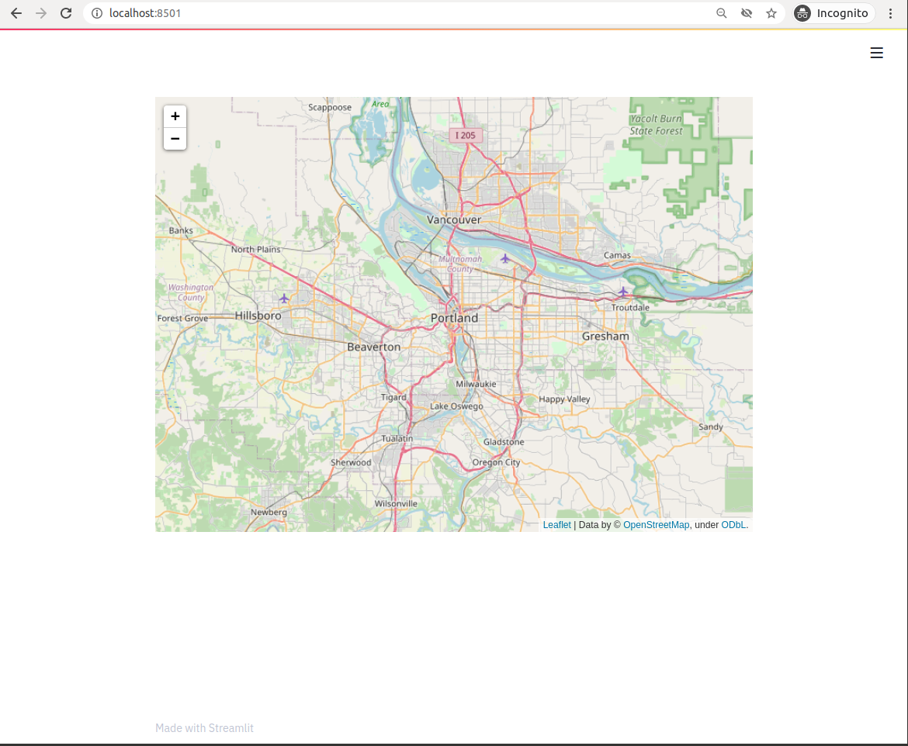

# streamlit-folium

This Streamlit Component is a work-in-progress to determine what functionality is desirable for a Folium and Streamlit integration. Currently, one method `folium_static()` is defined, which takes a `folium.Map` or `folium.Figure` object and displays it in a Streamlit app.

## Installation

```python
pip install streamlit-folium
```

## Example

```python
import streamlit as st
from streamlit_folium import folium_static
import folium

m = folium.Map(location=[45.5236, -122.6750])
folium_static(m)
```

